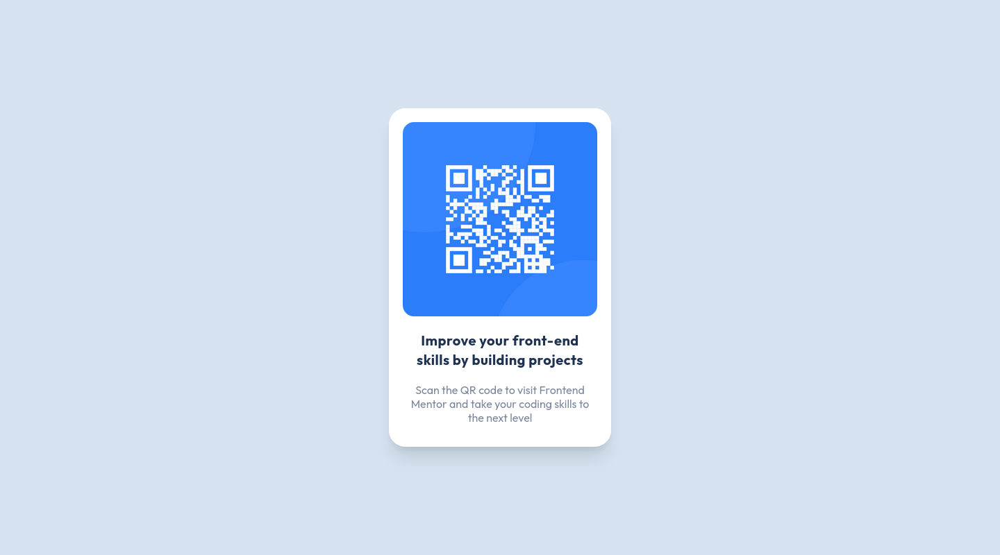

# Frontend Mentor - QR code component solution

This is a solution to the [QR code component challenge on Frontend Mentor](https://www.frontendmentor.io/challenges/qr-code-component-iux_sIO_H). Frontend Mentor challenges help you improve your coding skills by building realistic projects. 

## Table of contents

- [Frontend Mentor - QR code component solution](#frontend-mentor---qr-code-component-solution)
  - [Table of contents](#table-of-contents)
  - [Overview](#overview)
    - [Screenshots](#screenshots)
    - [Links](#links)
  - [Built with](#built-with)
  - [Author](#author)

## Overview

### Screenshots

### Links

- Solution URL: [github.com/s1adem4n/qr-code-component](https://www.github.com/s1adem4n/qr-code-component)
- Live Site URL: [s1adem4n.github.io/qr-code-component](https://www.s1adem4n.github.io/qr-code-component)

## Built with

- [Tailwind CSS](https://www.tailwindcss.com/) - CSS framework

## Author

- Frontend Mentor - [@s1adem4n](https://www.frontendmentor.io/profile/s1adem4n)
- Discord - [slademan#0200](https://www.discordapp.com/users/422301794438348803)

